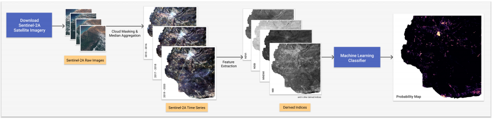

<p align="center">
<b><a href="#setup">Setup</a></b>
|
<b><a href="#code-organization">Code Organization</a></b>
|
<b><a href="#data">Data</a></b>
|
<b><a href="#acknowledgements">Acknowledgements</a></b>
</p>

# Detection of Rapidly Growing Informal Settlements 

This repository accompanies our research work for Informal Settlement Detection in Northern Colombia.

The goal of this project is to provide a means for faster, cheaper, and more scalable detection of rapidly growing informal settlements using low-resolution satellite images and machine learning.




## Setup
1. [Install miniconda](https://developers.google.com/earth-engine/guides/python_install-conda#install_miniconda)
1. [Create conda environment named ee](https://developers.google.com/earth-engine/guides/python_install-conda#install_api)
1. [Create conda environment named gdal_env then install gdal inside(https://gdal.org/download.html#conda)
1. Install conda environment named repo_env from environment.yml

Notable dependencies include:
- Ubuntu 16.04
- Anaconda3-2019.10
- earthengine-api==0.1.223
- gdal==3.1.0
- scikit-learn=0.21.3

## Code Organization
This repository is divided into three main parts:

- **data/**: contains the informal settlement datasets; also the destination for downloaded satellite imagery
- **notebooks/**: contains all Jupyter notebooks for data processing and model experimentation
- **utils/**: contains utility scripts for geospatial data pre-processing and modeling

We evaluated model performance across different negative sampling parameters, and that is reflected on 10K, 30K, 50K, in the 3 instances of 03_Model_Optimization.ipynb

## Data
For privacy concerns, we did not include in this repo the labelled training data that identified informal settlements in Colombia. If you need this dataset, please contact ThinkingMachines or IMMAP at hello@thinkingmachin.es, info@immap.org.

To use your own data, please:
1. Save informal settlement polygon as GeoPackage "area_mask.gpkg"
1. Save admin boundary for department/municipality as GeoPackage "area.gpkg"
2. Download satellite images using notebooks/00_Data_Download, (instructions how, inside)
3. Process the images using notebooks/01_Data_Preprocessing.

Resulting files and their directories should look like the following:
```
├── data
│   ├── pos_masks
│       ├── {area}_mask.gpkg
│   ├── admin_bounds
│       ├── {area}.gpkg
│   ├── images <derived>
│       ├── {area}_2015-2016.tif
│       ├── {area}_2017-2018.tif
│       ├── {area}_2019-2020.tif
│   ├── indices <derived>
│       ├── indices_{area}_2015-2016.tif
│       ├── indices_{area}_2017-2018.tif
│       ├── indices_{area}_2019-2020.tif
```

where area is the name of the area you're evaluating for as one word, e.g. Villa del Rosario -> villadelrosario.

## Acknowledgments
This work is supported by the [iMMAP Colombia](https://immap.org/colombia/).
